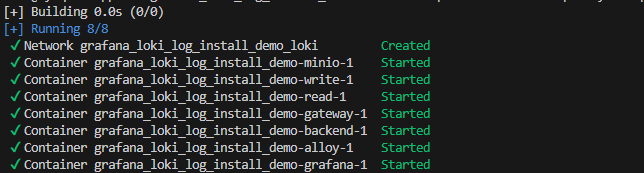
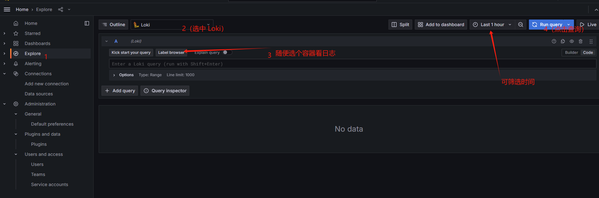
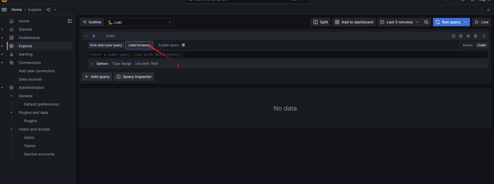
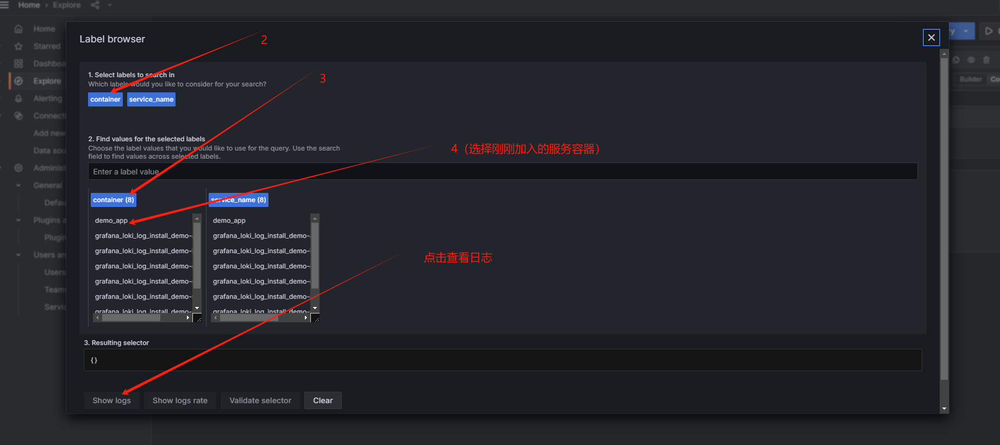

# 使用 loki 搭建日志系统 grafana_loki_log_install_demo

官方文档：https://grafana.com/docs/loki/latest/get-started/quick-start/

#### 下载 配置文件
```
https://github.com/grafana/loki/blob/main/examples/getting-started/docker-compose.yaml
https://github.com/grafana/loki/blob/main/examples/getting-started/loki-config.yaml
https://github.com/grafana/loki/blob/main/examples/getting-started/alloy-local-config.yaml

```
#### 直接 docker compose 执行

```
docker compose up -d
```


打开浏览器按照如下步骤查看



#### 接入自己的程序日志，以 go_demo 目录的 go 程序为例

进入 go_demo 目录下

##### 方式一：容器启动 go 服务

使用 go_demo/dockerfile 构建 go 服务镜像
```
 docker build -t demo_app_img .

```
加入到日志服务容器组
```
 docker run -d --network=grafana_loki_log_install_demo_loki --name=demo_app demo_app_img
```
按下面步骤查看日志



##### 方式二：nohup方式启动 go 服务

进入 go_demo 目录下

```
# 编译一个可执行文件
go build -o testgo main.go
# 新建一个 log 目录 ***日志输出到 log/a.log文件（这个文件位置很重要，后面配置会监听这个目录）***
# 启动 go 服务
nohup ./testgo > log/a.log 2>&1 &
```

进入 promtail 目录下


